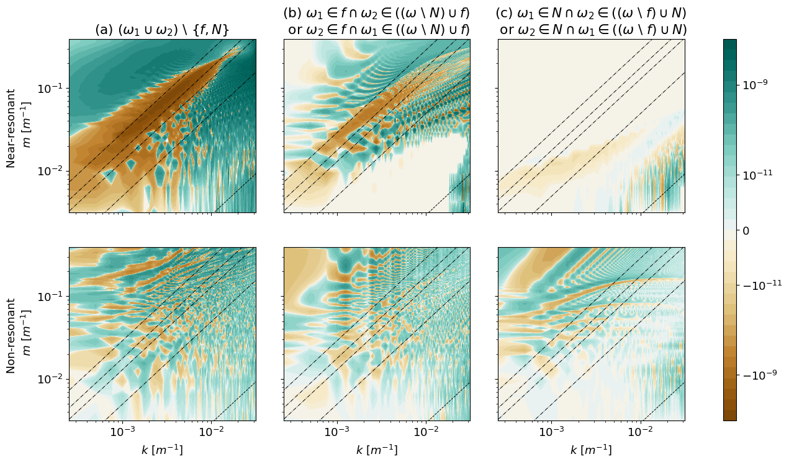
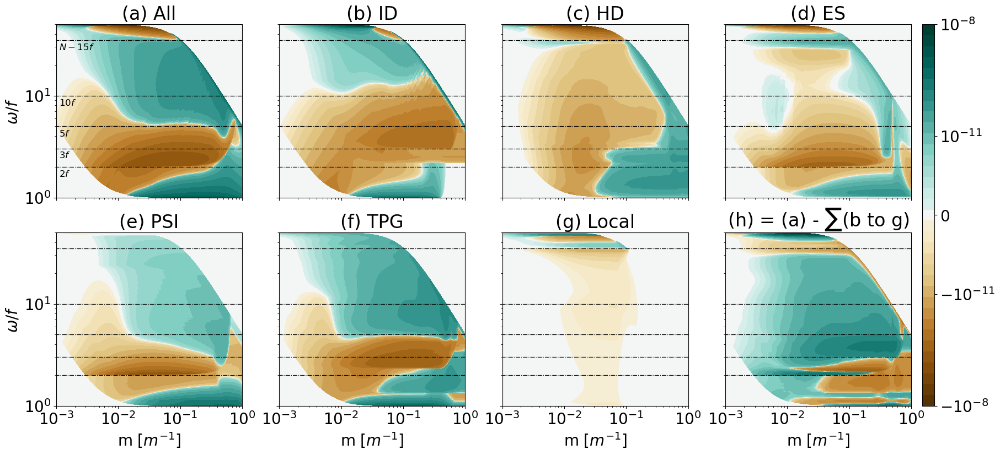

# Scattering Integral for Nonlinear Energy Transfers (ScINET)
ScINET is a computational framework based on the kinetic equation to evaluate energy transfers from wave-wave interactions under weak nonlinearity in oceanic internal gravity wave fields as formulated in Sebastia Saez et al. (2025 a,b). This framework expands upon previous numerical methods to integrate the kinetic equation derived in a non-hydrostatic Boussinesq system, see [Eden et al. (2019b)](https://journals.ametsoc.org/view/journals/phoc/49/3/jpo-d-18-0075.1.xml) . ScINET provides numerical methods to integrate the kinetic equation for finite times (ScINET-Genesis) and for infinite times ([ScINET-Infinity](https://github.com/pablosebastiasaez/ScINET/tree/main/Infinity)). All methods are highly parallelised providing a cost-effective framework capable of resolving multi-scale interactions with unprecedented detail and accuracy. 

## ScINET - Genesis
ScINET-Genesis integrates the kinetic equation for finite times, and therefore evalutes resonant (where the sum or difference of the frequency of two interacting waves equals the one of the generated wave) and non-resonant interactions without distinction. The numerical codes are implemented in Cython language.

* M1: The kinetic equation is integrated on a regular equidistant grid in wavenumber space, using positive and negative wavenumbers including zeros for any predefined energy density spectrum.
* M2: For isotropic energy density spectra, it is sufficient to evaluate the integral on the plane with zero meridional wavenumber in the zonal and vertical wavenumber space.

   
  <em>
  Figure 1: Content spectra of energy transfers using M2 for a finite time of 
   10 days within the modified GM76 model. 
  In (a) we exclude inertial and buoyancy oscillations. In (b) either the first or the 
  second component of the interacting triad is an inertial oscillation. 
  In (c) either the first or the second component of the interacting triad is a buoyancy 
  oscillation. In the upper row, we integrate over near-resonant interactions; whereas in the lower row, 
  we integrate over the remaining non-resonant interactions. 
  </em>

## [ScINET - Infinity](https://github.com/pablosebastiasaez/ScINET/tree/main/Infinity)
ScINET-Infinity makes use of the resonant condition and uses the limiting behaviour of infinite times to integrate a kinetic equation for only resonant interactions. The numerical codes are implemented in Julia native language.

* M3: Similarly to M2, the integration is carried out on a regular equidistant grid for one slice in wavenumber space (under consideration of an isotropic energy density spectrum), and the resonance condition is implemented with a minimum finding algorithm such that the frequency mismatch in the triad is minimized to numerical precision.
* [M4](https://github.com/pablosebastiasaez/ScINET/blob/main/Infinity/M4.jl): The kinetic equation is integrated on a loglog-grid in horizontal and vertical wavenumber after a coordinate transformation to cylindical coordinates. The resonance condition is implemented with a minimum finding algorithm.
* [M5](https://github.com/pablosebastiasaez/ScINET/blob/main/Infinity/M5.jl): The kinetic equation is integrated on a non-equidistant grid tailored for an accurate integration of the resonant surfaces defined by the resonance condition. The resonance condition is implemented analytically.
* [M5-triads](https://github.com/pablosebastiasaez/ScINET/blob/main/Infinity/M5-triads.jl) includes filters to identify and classify scale-separated from local interaction mechanisms.

   
  <em>
    Figure 2: M5-triads - Content spectrum of energy transfers within the GM76 model in (a), filtered energy transfers for ID in (b), for HD in (c), for ES in (d), for PSI in (e), for TPG in (f), for local interactions in (g), and the reminder in (h) as the difference of the overall integral in (a) and the sum of the filtered local and non-local interactions in (b to g).
  </em>

## Author
    * Pablo Sebastia Saez

## License
[MIT](LICENSE.txt)
